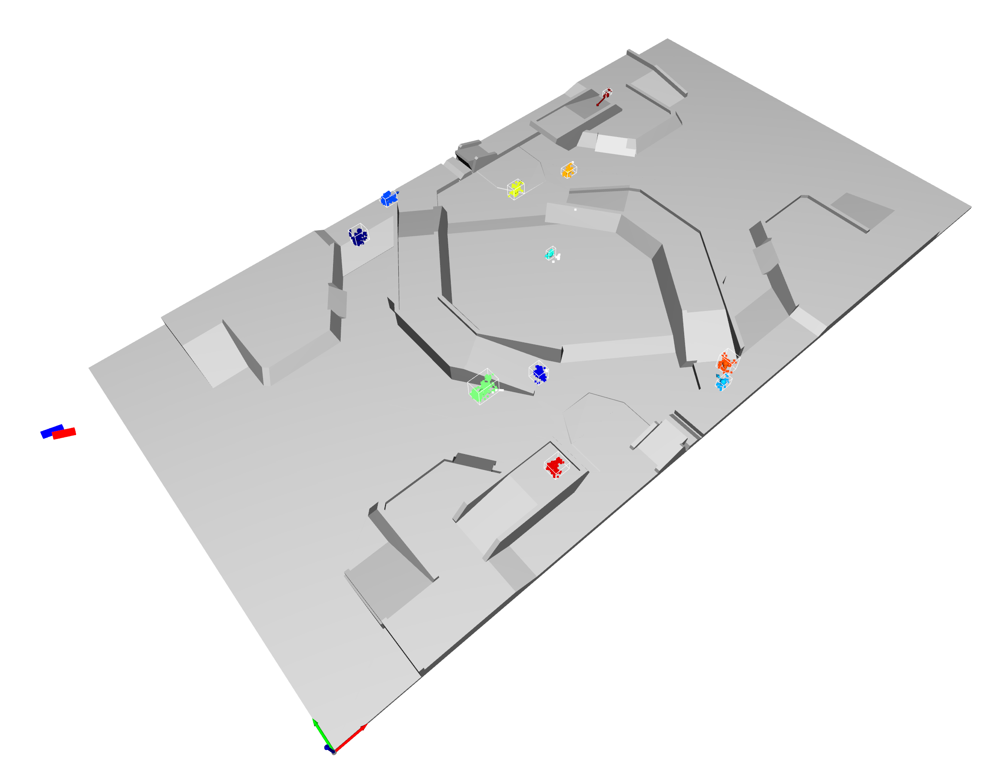
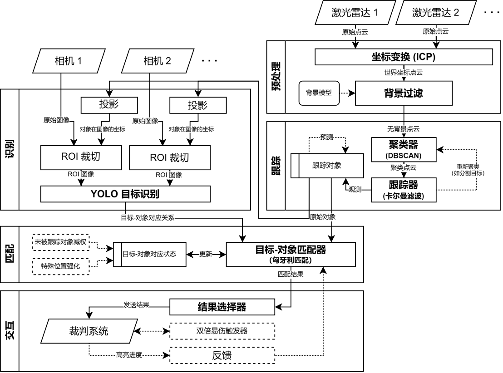

# PointCloudDetection

RoboMaster 2023 哈尔滨工业大学（深圳） 南工骁鹰战队 雷达站点云定位模块

**24 赛季完整源代码已开源：** [chenx-dust/radar_ros_ws](https://github.com/chenx-dust/radar_ros_ws)



## 设计原理

点云定位系统的设计目标，是作为雷达站确定场上运动目标的第一层检测，为后续的目标识别提供位置信息，同时借助其获取的丰富三维信息，进行目标预测从而保证跟踪的连续性。

详细原理可参考 RMUC 2024 青年工程师大会录像 [BV1NE4m197pm](https://www.bilibili.com/video/BV1NE4m197pm) 以及 [幻灯片](./doc/一种基于点云聚类的雷达算法.pptx)

## 项目优势

相比上海交通大学在 2021 赛季开源的雷达站代码 [COMoER/LCR_sjtu](https://github.com/COMoER/LCR_sjtu) 相比，我们采用基于点云的目标检测与跟踪，具有视觉识别所不具有的高灵敏性以及不全可见目标的检测能力。与此同时，我们的处理效率更为高效，在正常赛场条件下可实现 500Hz 以上[^1]的处理速度，保证了雷达站的实时性。

## 项目架构

本项目即我队雷达站整体架构中右上部分的“预处理”与“跟踪”部分。



项目代码结构：

```
main.cpp                    主程序
config.yaml                 配置文件
config.sample.yaml          样例配置文件
default.yaml                默认配置文件

Clustering.h/.cpp           聚类算法
Config.h                    配置读取
KalmanFilter.h/.cpp         卡尔曼滤波
PcContext.h/.cpp            线程间上下文
PcDetector.h/.cpp           点云处理 *核心*
PcReceiver.h/_**.cpp        点云接收
PcVisualizer.h/.cpp         点云可视化
Recorder.h/.cpp             内录程序
TargetMap.h/.cpp            目标跟踪 *核心*
Transform.h/.cpp            坐标变换处理
VisualizerHelper.h/_**.cpp  可视化相关
VoxelGrid.h/.cpp            点云体素化 *核心*
```

## 协议与内录

### 激光雷达

本项目提供了第二代 Livox 激光雷达（HAP/Mid-360）的驱动。但实现不完善，只提供了 HAP 通信协议中约定的 32 位笛卡尔坐标系包的接收；且该驱动不提供发包指令的发送功能，建议搭配 [shirok1/pylivox2](https://github.com/shirok1/pylivox2) 使用。

**值得注意的是，本模块的内录格式是流式记录接收到的激光雷达的数据包，支持 zstd 压缩。**

如需要 23 赛季的内录，可以与我们联系。

### 定位结果

我们使用 MQTT 协议实现模块间通信，如果需要迁移至其他框架，在此进行修改即可。

定位结果数据结构（发送于主题 `pc_detected` ）：

```jsonc
{
  "enemies": [{
    "id": uint,                           // 目标编号
    "position": [float, float, float],    // 位置坐标（单位：mm）
    "velocity": [float, float, float],    // 速度矢量（单位：mm/s）
    "is_predict": bool,                   // 该数据是否为预测值
    "lost_time": uint,                    // 丢失跟踪的帧数
    "is_discarded": bool                  // 是否结束跟踪（目标被废弃）
  }]
}
```

该部分没有内录，有需要者可以用 MQTT Broker 进行录制。

## 构建与部署

请参阅 [构建指南](./doc/BUILDING.md) 与 [部署指南](./doc/DEPLOYMENT.md) 。

## 优化方向

勾选的代表这些优化已在 24 赛季代码中得到优化。

- [X] 采用更科学的跟踪模型，以取得更好的效果
- [X] 程序解耦，处理模块可插拔化，以便硬件拓展
- [ ] 点云聚类能力优化，提升抗遮挡、抗误合并能力
- [ ] 多模态融合，以得到更好的感知能力
- [ ] 部署自动化，减少人力消耗
- [ ] 单元测试，减少 Bug 的产生

[^1]: 在一台搭载 i7-12700H 处理器的笔记本上，开启 `-O3` 优化选项，使用 ICX 编译器编译，于读取 PCD 文件的模式下达成。实际运行受到激光雷达速度限制，能达到稳定 49Hz 的处理速率。
