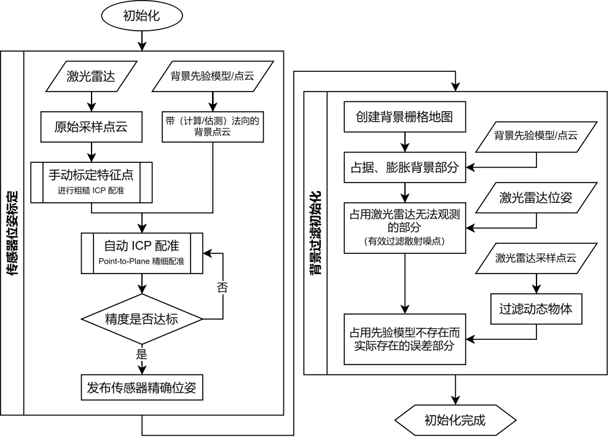
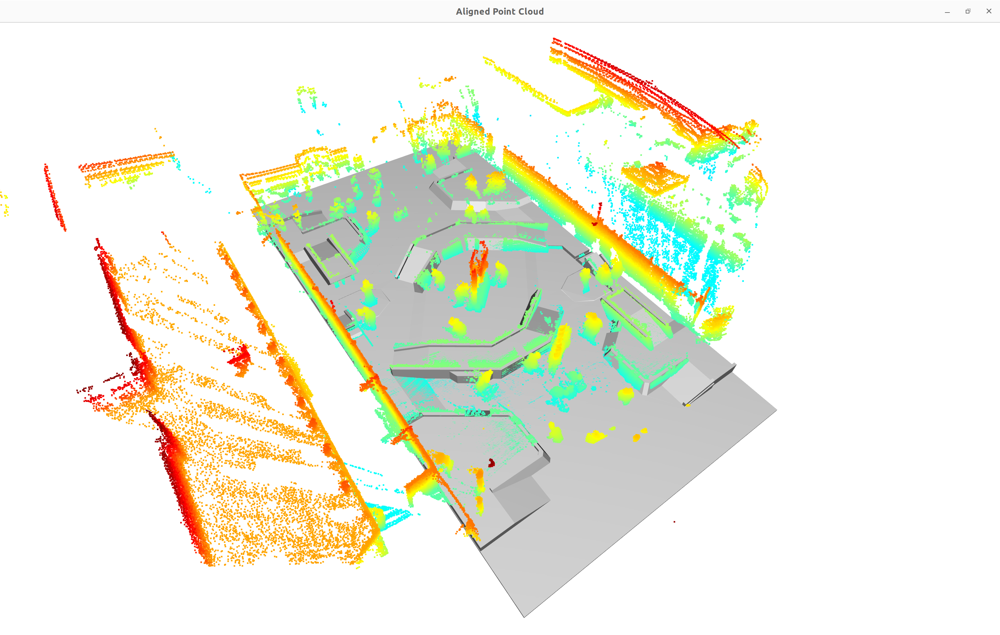
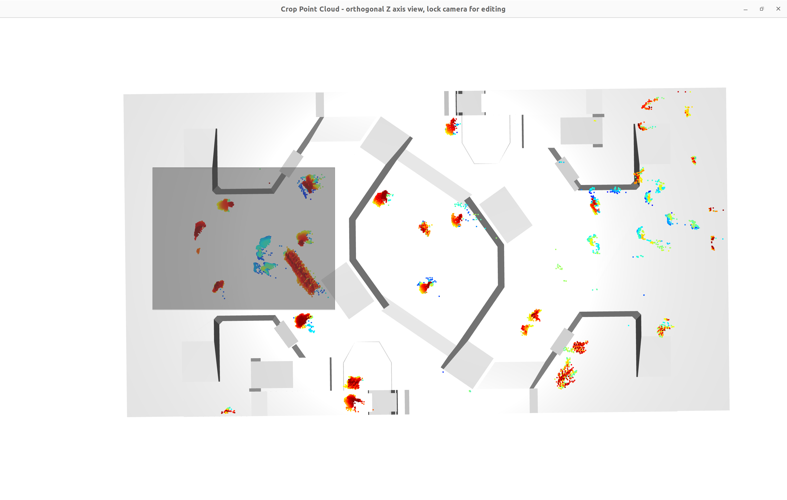
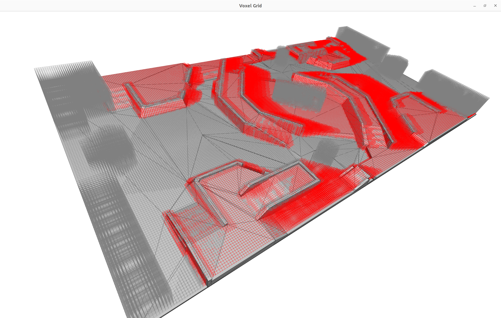
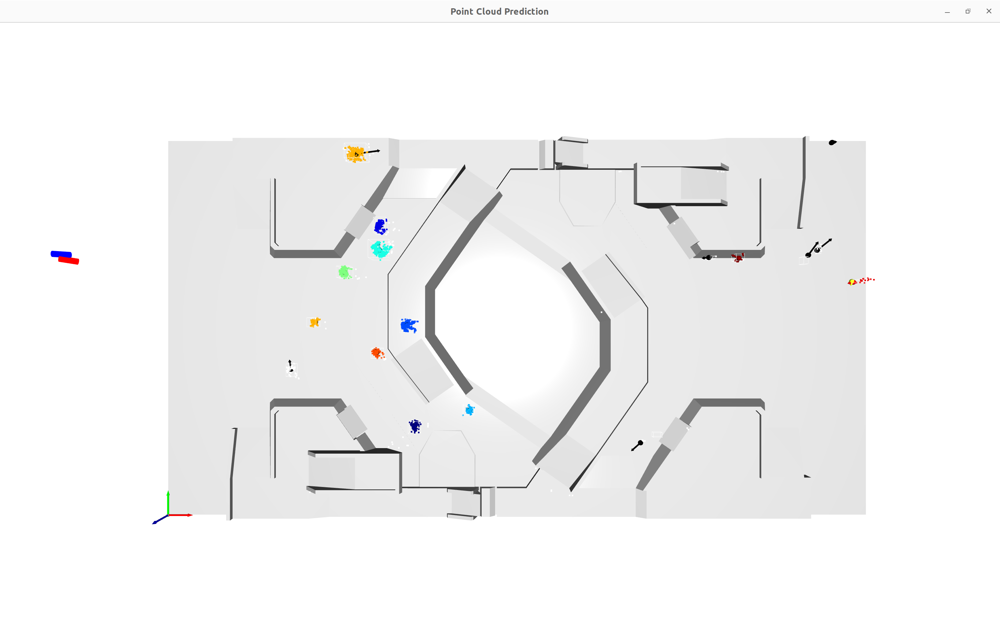

## 部署教程

### 部署准备

运行程序前，必须保证运行目录（`$PWD`）下有以下文件：

- 配置文件
    + `config.yaml` 当前配置文件（可为空）
    + `default.yaml` 默认配置文件
- 资源文件（具体目录可由配置文件中的 `Mesh` 修改）
    + `resource/bg2align.stl` 配准参考场地模型
    + `resource/bg2filter.stl` 过滤参考场地模型

如果使用激光雷达内录，请一并准备好内录文件。我们可以提供我队 2023 赛季雷达站内录资料的副本。

### 场地模型

我们的场地模型取自 RoboMaster 组委会官方开源的场地模型。推荐使用 STL 格式，以 mm 为单位。

场地模型分为配准模型与过滤模型：

- 配准模型：用于自动配准与可视化，一般不包含场地道具，有准确但简单的场地地形。
- 过滤模型：用于点云过滤，常常是在配准模型的基础上用多面体将场地道具进行包裹，确保场地道具的点云被滤去。

我们生成场地模型的流程：

1. 用 SolidWorks 打开官方模型，删除大量的装饰性部件，只保留场地地形，导出为 STL 文件；
2. 用 Materialise Magics 对 STL 模型进行简化与修复。

在仓库中随附的是 23 赛季的场地模型，如需要 24 赛季场地模型请与我们联系。

### 基础配置

我们在默认配置文件 `default.yaml` 中提供了大部分选项的注释，可以根据自身情况进行调整。其中有以下值得特别注意的选项：

- `RealCompetitionMode` 真实比赛模式
    - 决定是否采用内录，用于上场和场下调试快速切换。
- `PointCloud.replay.path` 内录路径
    - 告知程序读取内录文件的路径
- `TransForm.localTrans.enable` 是否使用本地变换
    - 决定是否采用由配置文件指定的变换，启用将会忽略由 MQTT 传来的 EPNP 结果。

### 初始化步骤

本项目初始化分为以下几个阶段：

0. 预初始化

    这个阶段会读取配置文件，建立与 MQTT 服务器、激光雷达的连接，打开内录，读取相机到激光雷达的坐标变换矩阵。在这个阶段，你可能会碰到以下问题：

    - 报错 `[error] Communication: MQTT error [-1]: TCP/TLS connect failure, then commu_enable set false.`
        - 与 MQTT 服务器建立连接失败，将会禁用通信功能。
        - 对于单纯的点云模块调试而言是不需要与 MQTT 服务器建立连接的，可以忽略。
    - 在 `[info] Reading point cloud...` 后卡住，无法继续进入下一阶段
        - 一般而言是点云读取问题，请检查激光雷达驱动或内录是否正常工作。

1. 点云配准

    如果没有采用手动配准选项（`Transform.manualAlign.enable` 为 `false`），则本阶段不需要人工干预。你会看到一个自动配准结果：

    

    确认配准结果没有问题后可以按 Q 键退出。手动配准请参考 Open3D 官方的 [手动 ICP 文档](https://www.open3d.org/docs/release/tutorial/visualization/interactive_visualization.html#manual-registration) 进行操作。

2. 背景点过滤

    这个阶段会将粗过滤后的所有点呈现出来，你可以选择将所有的场上物体的正常点手动筛去，保留场上没有过滤干净的背景点，送入栅格图中进行标记，从而提高过滤效果。

    

    基础操作指南：
    - 按 K 键，锁定视角，进入选择模式；
    - 鼠标左键拖动选择矩形、按住 Ctrl 同时左键拖动选择多边形；
    - 按 C 键，筛去框选中的所有点；
    - 按 Q 键，离开本界面。

3. 栅格图生成

    这个阶段会综合场地模型、激光雷达位姿，生成激光雷达无法扫描到的区域的栅格图，用于高效过滤点云。这里会弹出 UI 用于检视结果：

    

    确认结果没有问题后可以按 Q 键退出。

4. 开始工作

    初始化结束，程序将进入正常工作阶段：

    